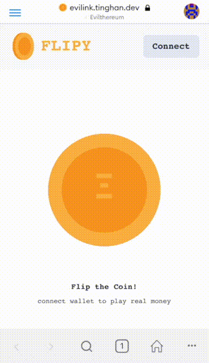
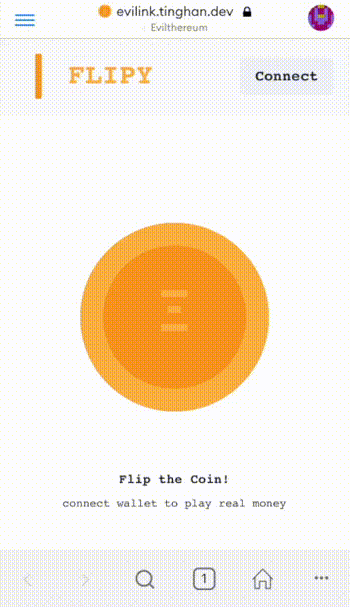

# EVILink

EVILink shows that a malicious miner still has a slim chance to tamper randomness provided by Chainlink's [VRF](https://docs.chain.link/docs/chainlink-vrf) solution.

- [EVILink](#evilink)
  - [Concept](#concept)
    - [What a Slim Chance](#what-a-slim-chance)
    - [Proof of Concept](#proof-of-concept)
    - [Rethink](#rethink)
    - [Take Away](#take-away)
  - [Development](#development)
    - [Prerequisite](#prerequisite)
    - [Prepare](#prepare)
    - [Build Docker Image](#build-docker-image)
    - [Start Docker Container](#start-docker-container)

## Concept

### What a Slim Chance

Chainlink VRF is an awesome solution for **NEARLY tamper-proof randomness**. Why say **NEARLY tamper-proof**? For a verifiable randomness implemented by Chainlink, it is composed by these parameters ordered by their generation time:

1. `vrf_key` - generated before the corresponding public key registered as VRF service
2. `user_seed` - provided when user interact with the contract
3. `block_hash` and `block_number` - block containing the event `RandomnessRequest`

The only parameter tamperable after transaction sent is the `block_hash`, which can be easily tuned by change the block head extra data, but miner still has no way to predict randomness if it does not have `vrf_key`. However, there exists these situations for randomenss to be predictable:

1. `vrf_key` is leaked to miner
2. `vrf_key` is held by miner from the beginning
3. miner conspires with the malicious `vrf_key` holder

So miner can tune the `block_hash` to get the favorable result before mining.

### Proof of Concept

Here I present the first situation to hack a coin tossing game, after malicious miner steals the `vrf_key`, it can make owner always win and others always lose.

| Owner                                | Others                                 |
| ------------------------------------ | -------------------------------------- |
|  |  |

### Rethink

So why Chainlink includes the manipulatable block information to be part of randomness? The reason is because the randomness will be fully manipulatable by `vrf_key` holder if it is only composed by `vrf_key` and `user_seed` (when holder is the user). The design to include block information prevents the **single-point-malicious** in most time.

### Take Away

From Chainlink's awesome [blog](https://blog.chain.link/verifiable-random-functions-vrf-random-number-generation-rng-feature/#the-planned-evolution-of-chainlink-vrf), they are already integrating [threshold signatures](https://blog.chain.link/threshold-signatures-in-chainlink) with VRF to prevent **single-key-leaked-failure**, which is not only cost-effective and high-availability, but also is almost a tamper-proof randomness solution (in theory we still have very slim change to collect enough key shares, but extremely hard). Super looking forward to the approach.

But before the upcoming approach, we can still use current version VRF with some good practices:

1. Contracts should have a mechanism (by voting or by admin) to change the VRF service once current one is thought malicious or key leaked.
2. Contracts could request multiple randomness in **one transaciton** and combine incoming randomnesses over threshold to be final randomness to act like threshold signature approach, but it costs much more both time and LINK.

## Development

### Prerequisite

- go1.15
- yarn2

### Prepare

```bash
# build chainlink vrf for gyp binding
pushd packages/chainlink-vrf/go && make && popd
yarn
yarn build
```

### Build Docker Image

```bash
bash script/run.sh build
```

### Start Docker Container

```bash
cp docker-compose.sample.env docker-compose.env
# after update the values in docker-compose.env
bash script/run.sh up
```
